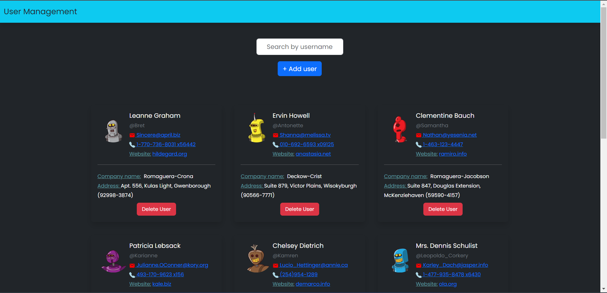

# User Management System

A frontend web application that displays users in the form of cards.

## Functionality:
- Fethes user details from API `https://jsonplaceholder.typicode.com/users`
and displays it's details in the form of cards.
- Add user feature enables adding new user to the same list of cards
- Local storage allows you to access the user details.

## Stack
- Reactjs and Bootstrap

## Snapshot:

